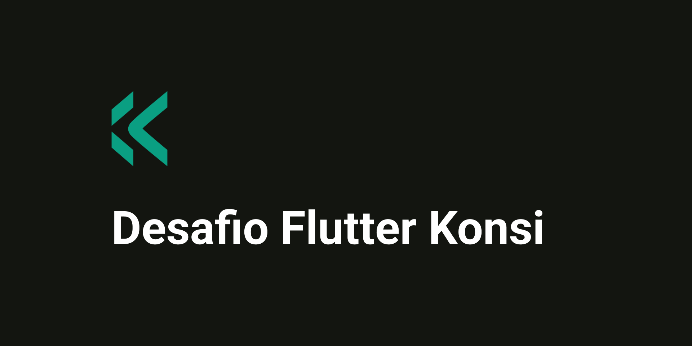

<p align="center">
   <a href="https://www.linkedin.com/in/bernardoveras/">
    
   </a>
</p>
<h1 align="center">
    
</h1>

<h4 align="center"> 
	🚧 Desafio Flutter da Konsi 🚧
</h4>

<p align="center">
	
	<!--  -->
</p>

<p align="center">
 <a href="#-sobre-o-desafio">Sobre</a> •
 <a href="#-funcionalidades">Funcionalidades</a> •
 <a href="#-layout">Layout</a> • 
 <a href="#-como-executar-o-projeto">Como executar</a> • 
 <a href="#-tecnologias">Tecnologias</a> • 
 <a href="#-autor">Autor</a> • 
</p>


## 💻 Sobre o desafio

Este desafio, proposto pela Konsi, consiste em desenvolver um aplicativo mobile em Flutter que facilite o trabalho do Carlos, um servidor público que organiza documentos por localidade.
No dia a dia, Carlos pesquisa endereços de CEP na internet para obter informações como o bairro correspondente e visualizar no mapa a localização desse bairro. No entanto, ele enfrenta dificuldades tanto na anotação manual dos CEPs em uma caderneta, o que atrasa seu fluxo de trabalho, quanto na busca por registros que já anotou.

O objetivo do aplicativo é agilizar esse processo, permitindo que Carlos consulte e registre endereços de forma mais intuitiva e prática, superando as limitações do método manual e facilitando sua visualização de endereços no mapa.

---

## ⚙️ Funcionalidades

- [ ] Mapa
- [ ] Busca de endereço por CEP
- [ ] Armazenamento de endereço na cardeneta

---

## 🎨 Layout

O layout da aplicação está disponível no Figma:

<a href="https://www.figma.com/design/dKxe0s6uPo1Ha84hjThoh7/Desafio-konsi?node-id=0-1&node-type=canvas">
  
</a>

---

## 🛣️ Como executar o projeto

### Pré-requisitos

Antes de começar, você vai precisar ter instalado em sua máquina as seguintes ferramentas:
[Dart](https://dart.dev/), [Flutter](https://flutter.dev/).
Além disto é bom ter um editor para trabalhar com o código como [VSCode](https://code.visualstudio.com/)

A versão do Flutter utilizada neste projeto é a **3.24.4**.

#### 🧭 Rodando o aplicativo

```bash

# Clone este repositório
$ git clone git@github.com:bernardoveras/konsi_challenge.git

# Acesse a pasta do projeto no seu terminal/cmd
$ cd konsi_challenge

# Instale as dependências
$ flutter pub get

# Execute a aplicação em modo de desenvolvimento
$ flutter run

```

---

## 🛠 Tecnologias

As seguintes ferramentas foram usadas na construção do projeto:

#### **Mobile**

-   **[Dart](https://dart.dev/)**
-   **[Flutter](https://flutter.dev/)**

#### [](https://github.com/cubos-academy/academy-template-readme-projects#utilit%C3%A1rios)

**Utilitários**

-   Protótipo:  **[Figma](https://www.figma.com/)**  →  **[Protótipo](https://www.figma.com/design/dKxe0s6uPo1Ha84hjThoh7/Desafio-konsi?node-id=0-1&node-type=canvas)**


## 🧙‍♂️ Autor

<a href="https://www.linkedin.com/in/bernardoveras/">
 
 <br />
 <sub><b>Bernardo Veras</b></sub></a> <a href="https://www.linkedin.com/in/bernardoveras/" title="Bernardo Veras">✨</a>
 <br />

---